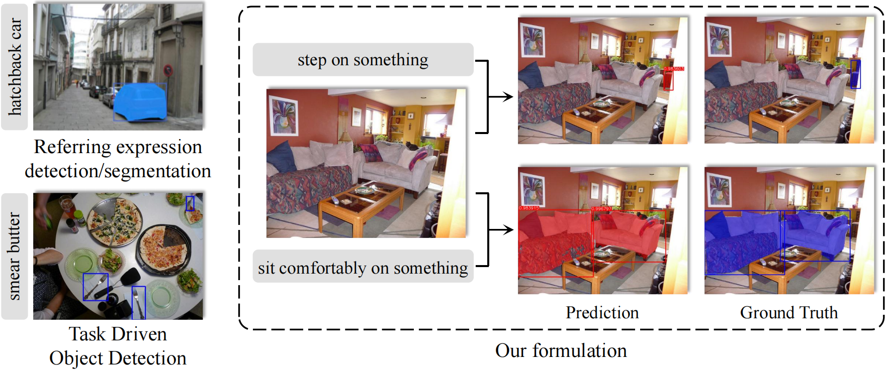
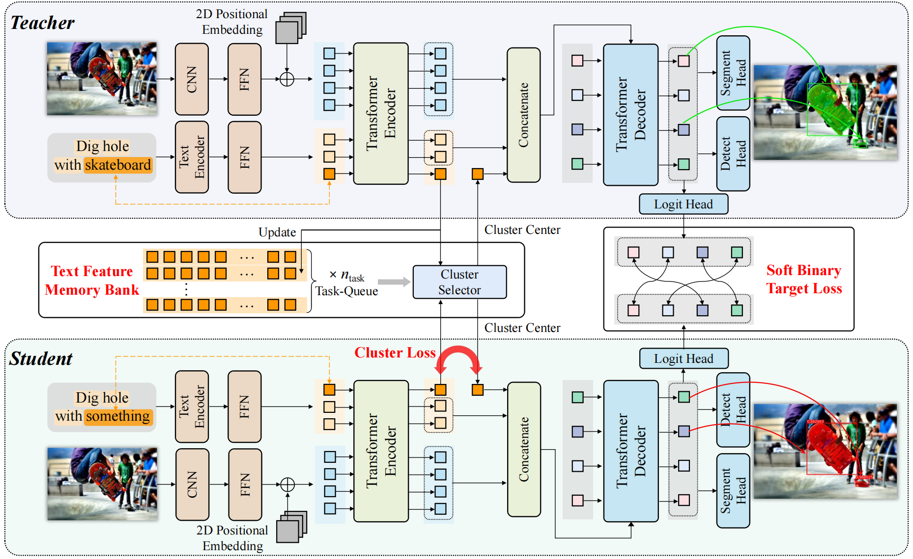

# TOIST: Task Oriented Instance Segmentation Transformer with Noun-Pronoun Distillation

This repository is an official implementation of [TOIST](tbd):

TOIST: Task Oriented Instance Segmentation Transformer with Noun-Pronoun Distillation  
[Pengfei Li](https://scholar.google.com/citations?hl=en&user=hmii_L8AAAAJ), [Beiwen Tian](https://github.com/TB5zhh), [Yongliang Shi](https://github.com/liangyongshi), [Xiaoxue Chen](https://scholar.google.com/citations?user=_tz64W0AAAAJ&hl=en), [Hao Zhao](https://sites.google.com/view/fromandto), [Guyue Zhou](https://air.tsinghua.edu.cn/en/info/1046/1196.htm), [Ya-Qin Zhang](https://air.tsinghua.edu.cn/en/info/1046/1188.htm)

**In NeurIPS 2022**

## Introduction
Current referring expression comprehension algorithms can effectively detect or segment objects indicated by nouns, but how to understand verb reference is still under-explored. As such, we study the challenging problem of task oriented detection, which aims to find objects that best afford an action indicated by verbs like *sit comfortably on*. Towards a finer localization that better serves downstream applications like robot interaction, we extend the problem into task oriented instance segmentation. A unique requirement of this task is to select *preferred* candidates among possible alternatives. Thus we resort to the transformer architecture which naturally models pair-wise query relationships with attention, leading to the TOIST method. In order to leverage pre-trained noun referring expression comprehension models and the fact that we can access privileged noun ground truth during training, a novel noun-pronoun distillation framework is proposed. Noun prototypes are generated in an unsupervised manner and contextual pronoun features are trained to select prototypes. As such, the network remains noun-agnostic during inference. We evaluate TOIST on the large-scale task oriented dataset COCO-Tasks and achieve +10.9\% higher $\rm{mAP^{box}}$ than the best-reported results. The proposed noun-pronoun distillation can boost $\rm{mAP^{box}}$ and $\rm{mAP^{mask}}$ by +2.8\% and +3.8\%.

<p align="center"></p>

<p align="center"></p>


If you find our code or paper useful, please consider citing:
```bibtex
coming soon...
```

This repository is a PyTorch implementation.

## Datasets
Please follow the instructions in [the official website of COCO-Tasks](https://github.com/coco-tasks/dataset) to download the dataset.

You can organize the 'data' folder as follows:
```
data/
  ├── id2name.json
  ├── images/
  │    ├── train2014/
  │    └── val2014/
  └── coco-tasks/
       └── annotations/
            ├── task_1_train.json
            ├── task_1_test.json
            ...
            ├── task_14_train.json
            └── task_14_test.json
```
Then set the arguments `coco_path`, `refexp_ann_path` and `catid2name_path` in file `configs/tdod.json` to be the path of `data/images/`, `data/coco-tasks/annotations/` and `data/id2name.json`, respectively.

## Installation
Make sure that you have all dependencies in place. The simplest way to do so is to use anaconda.

Make a new conda env and activate it:
```
conda create --name TOIST python=3.8
conda activate TOIST
```

Install the the packages in the requirements.txt:
```
pip install -r requirements.txt
```

## Training
Run the following command for detection training of plain TOIST:
```
CUDA_VISIBLE_DEVICES=1,2,3,4,5,6 python -m torch.distributed.launch --master_port=23456 --nproc_per_node=6 --use_env main.py \
--dataset_config configs/tdod.json \
--train_batch_size 6  \
--valid_batch_size 8  \
--load pretrained_resnet101_checkpoint.pth  \
--ema --text_encoder_lr 1e-5 --lr 5e-5 \
--num_workers 5 \
--output-dir 'logs/test' \
--eval_skip 1 \
--no_nsthl2_loss
```

With the pre-trained detection model, run the following command for segmentation training of plain TOIST:
```
CUDA_VISIBLE_DEVICES=1,2,3,4,5,6 python -m torch.distributed.launch --master_port=23456 --nproc_per_node=6 --use_env main.py \
--dataset_config configs/tdod.json \
--train_batch_size 2  \
--valid_batch_size 4  \
--frozen_weights /path/to/trained/detection/checkpoint \
--mask_model smallconv \
--no_aux_loss \
--ema --text_encoder_lr 1e-5 --lr 5e-5 \
--num_workers 5 \
--output-dir 'logs/test' \
--eval_skip 1 \
--no_contrastive_align_loss
```

With the pre-trained teacher and student detection model, run the following command for detection training of TOIST with distillation:
```
CUDA_VISIBLE_DEVICES=1,2,3,4,5,6 python -m torch.distributed.launch --master_port=23456 --nproc_per_node=6 --use_env main.py \
--dataset_config configs/tdod.json \
--train_batch_size 3  \
--valid_batch_size 8  \
--load /path/to/noun(teacher)/detection/checkpoint  \
--load_sth /path/to/pronoun(student)/detection/checkpoint \
--ema --text_encoder_lr 1e-5 --lr 5e-5 \
--num_workers 5 \
--output-dir 'logs/test' \
--eval_skip 1 \
--softkd_loss \
--softkd_coef 50 \
--distillation \
--cluster \
--cluster_memory_size 1024 \
--cluster_num 3 \
--cluster_feature_loss 1e4
```


## Evaluation
To evaluate the detection result of the plain TOIST:
```
CUDA_VISIBLE_DEVICES=0 python -m torch.distributed.launch --master_port=23456 --nproc_per_node=1 --use_env main.py \
--dataset_config configs/tdod.json \
--valid_batch_size 8  \
--num_workers 5 \
--resume /path/to/checkpoint  \
--ema --eval \
--no_contrastive_align_loss
```

To evaluate the segmentation result of the plain TOIST:
```
CUDA_VISIBLE_DEVICES=0 python -m torch.distributed.launch --master_port=23456 --nproc_per_node=1 --use_env main.py \
--dataset_config configs/tdod.json \
--valid_batch_size 8  \
--num_workers 5 \
--resume /path/to/checkpoint  \
--ema --eval \
--mask_model smallconv \
--no_contrastive_align_loss
```

To evaluate the result of TOIST with noun-pronoun distillation:
```
CUDA_VISIBLE_DEVICES=0 python -m torch.distributed.launch --master_port=23456 --nproc_per_node=1 --use_env main.py \
--dataset_config configs/tdod.json --valid_batch_size 4  \
--num_workers 5 \
--resume /path/to/checkpoint  \
--ema --eval \
--cluster \
--cluster_memory_size 1024 \
--cluster_num 3 \
--mask_model smallconv \
--no_contrastive_align_loss \
--distillation
```

## Pre-trained Models
We provide our pretrained models on [Google Drive](https://drive.google.com/drive/folders/1g-4adboRxwO3yuob9tTnq8BZvjbbeVO6?usp=sharing).

## License

TOIST is released under the MIT License.


## Acknowledgment

We would like to thank the open-source data and code of [COCO-Tasks](https://coco-tasks.github.io/), [Microsoft COCO](https://cocodataset.org/#home), [GGNN](https://github.com/yassersouri/task-driven-object-detection), [MDETR](https://github.com/ashkamath/mdetr), [DETR](https://github.com/facebookresearch/detr) and [Detectron2](https://github.com/facebookresearch/detectron2).


